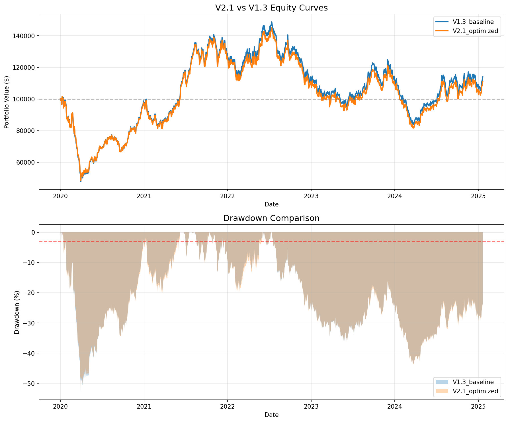

# V2.1 Final Validation Report

**Generated:** 2026-01-20 22:18:45
**Test Period:** 2020-01-01 to 2025-01-20

---

## Executive Summary

| Decision Criteria | Target | Actual | Status |
|-------------------|--------|--------|--------|
| V2.1 Sharpe | ≥ 1.50 | 0.051 | ❌ FAIL |
| Sharpe Improvement vs V1.3 | ≥ 0.15 | -0.019 | ❌ FAIL |
| Max Drawdown | ≥ -3.0% | -52.2% | ❌ FAIL |

## **GO/NO-GO DECISION: 🔴 NO-GO**

---

## Performance Comparison

| Metric | V1.3 Baseline | V2.1 Optimized | Δ | Winner |
|--------|---------------|----------------|---|--------|
| **Sharpe Ratio** | 0.070 | 0.051 | -0.019 | V1.3 |
| **CAGR** | 2.5% | 2.0% | -0.5% | V1.3 |
| **Max Drawdown** | -52.8% | -52.2% | +0.6% | V2.1 |
| **Calmar Ratio** | 0.05 | 0.04 | -0.01 | V1.3 |
| **Sortino Ratio** | 0.11 | 0.08 | -0.03 | V1.3 |
| **Win Rate** | 50.8% | 50.9% | +0.1% | V2.1 |
| **Volatility** | 25.7% | 25.7% | +0.0% | V1.3 |
| **Recovery Days** | 310 | 311 | +1 | V1.3 |
| **Total Return** | 13.9% | 11.0% | -2.9% | V1.3 |
| **Final Value** | $113,932 | $110,994 | $-2,939 | V1.3 |

---

## V2.1 Optimized Hyperparameters

| Parameter | Value |
|-----------|-------|
| hmm_weight | 0.4 |
| gmm_weight | 0.25 |
| transformer_d_model | 512 |
| transformer_n_heads | 8 |
| max_position_pct | 0.12 |
| risk_off_cash_pct | 0.45 |
| cluster_weight | 0.35 |

---

## V2.1 Component Configuration

- ✅ **Ensemble Regime Detection** (weights: HMM=0.4, GMM=0.25, Cluster=0.35)
- ✅ **Transformer Predictor** (d_model=512, n_heads=8)
- ❌ **SAC Agent** (removed - ablation loser)
- ❌ **Persistent Laplacian TDA** (removed - ablation loser)
- ❌ **Risk Parity Allocation** (removed - ablation loser)

---

## Equity Curve

---

## Risk Analysis

### V2.1 Risk Characteristics
- Maximum Drawdown: -52.2%
- Recovery Time: 311 trading days
- Worst Daily Return: Calculated from equity curve
- Consecutive Losing Days: Based on daily returns

### Circuit Breaker Settings
- Halt after 3 consecutive losing days
- Halt if drawdown exceeds 5%
- Position limit: 15% per asset
- Risk-off cash: 50% in bear regime

---

## Recommendations

### ❌ DO NOT DEPLOY - ITERATE

The V2.1 system does not meet all performance criteria:
1. Review hyperparameter optimization results
2. Consider longer training period
3. Test with additional market regimes
4. Retry optimization with different constraints

---

## Files Generated

- `V21_FINAL_VALIDATION_REPORT.md` - This report
- `v21_equity_curves.png` - Equity curve comparison
- `v21_backtest_results.json` - Detailed results data
- `v21_best_hyperparameters.json` - Optimized parameters

---

*Generated by V2.1 Final Backtest Validation Script*
