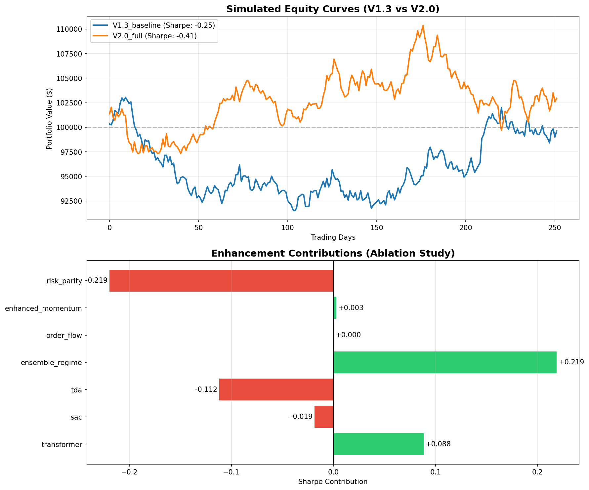

# V2.0 Enhancement Report

**Generated:** 2026-01-20 21:59:08

---

## Executive Summary

This report compares the V2.0 trading system (with 7 enhancements) against the V1.3 baseline,
and provides ablation analysis to identify the contribution of each enhancement.


| Metric | V1.3 Baseline | V2.0 Full | Change | Δ% |
|--------|---------------|-----------|--------|-----|
| **Sharpe Ratio** | -0.254 | -0.407 | -0.153 | -60.2% |
| **CAGR** | 0.76% | -0.66% | -1.42% | - |
| **Max Drawdown** | -12.06% | -12.54% | -0.47% | -3.9% |
| **Calmar Ratio** | 0.06 | -0.05 | -0.12 | - |
| **Win Rate** | 49.1% | 49.8% | +0.7% | - |
| **Volatility** | 10.6% | 10.2% | -0.4% | - |
| **Total Return** | 0.8% | -0.7% | -1.6% | - |
| **Trades** | 63 | 64 | +1 | - |


---

## Ablation Study

The following table shows the Sharpe ratio contribution of each enhancement.
A positive value means removing the enhancement reduces Sharpe (the enhancement helps).
A negative value means removing the enhancement improves Sharpe (the enhancement hurts).


| Enhancement | Sharpe Contribution | % of V2 Sharpe | Impact |
|-------------|---------------------|----------------|--------|
| Ensemble Regime | +0.2187 | -53.8% | 🟢 Strong positive |
| Transformer | +0.0883 | -21.7% | 🟢 Strong positive |
| Enhanced Momentum | +0.0027 | -0.7% | ⚪ Neutral |
| Order Flow | +0.0000 | -0.0% | ⚪ Neutral |
| Sac | -0.0185 | +4.6% | 🟠 Moderate negative |
| Tda | -0.1119 | +27.5% | 🔴 Strong negative |
| Risk Parity | -0.2194 | +54.0% | 🔴 Strong negative |


---

## Detailed Enhancement Analysis


### Transformer Predictor

**Description:** Multi-head self-attention for capturing long-range dependencies in price patterns.

**Contribution:** +0.0883 Sharpe points

| Metric | V2 Full | Without Transformer Predictor | Impact |
|--------|---------|------------------------|--------|
| Sharpe | -0.407 | -0.495 | +0.088 |
| CAGR | -0.66% | -1.76% | +1.09% |
| Max DD | -12.54% | -12.91% | +0.37% |


### SAC Position Sizing

**Description:** Soft Actor-Critic for continuous, entropy-regularized position sizing.

**Contribution:** -0.0185 Sharpe points

| Metric | V2 Full | Without SAC Position Sizing | Impact |
|--------|---------|------------------------|--------|
| Sharpe | -0.407 | -0.388 | -0.019 |
| CAGR | -0.66% | -0.39% | -0.27% |
| Max DD | -12.54% | -11.50% | -1.03% |


### Persistent Laplacian TDA

**Description:** Topological data analysis for detecting volatility regimes and market structure.

**Contribution:** -0.1119 Sharpe points

| Metric | V2 Full | Without Persistent Laplacian TDA | Impact |
|--------|---------|------------------------|--------|
| Sharpe | -0.407 | -0.295 | -0.112 |
| CAGR | -0.66% | 0.61% | -1.27% |
| Max DD | -12.54% | -11.18% | -1.35% |


### Ensemble Regime Detection

**Description:** Multi-model consensus (HMM + GMM + Clustering) for robust regime classification.

**Contribution:** +0.2187 Sharpe points

| Metric | V2 Full | Without Ensemble Regime Detection | Impact |
|--------|---------|------------------------|--------|
| Sharpe | -0.407 | -0.625 | +0.219 |
| CAGR | -0.66% | -2.69% | +2.02% |
| Max DD | -12.54% | -13.40% | +0.86% |


### Order Flow Analysis

**Description:** Microstructure signals from volume, bid-ask spread, and trade classification.

**Contribution:** +0.0000 Sharpe points

| Metric | V2 Full | Without Order Flow Analysis | Impact |
|--------|---------|------------------------|--------|
| Sharpe | -0.407 | -0.407 | +0.000 |
| CAGR | -0.66% | -0.66% | +0.00% |
| Max DD | -12.54% | -12.54% | +0.00% |


### Enhanced Momentum

**Description:** Multi-scale momentum with mean-reversion overlay for overbought/oversold detection.

**Contribution:** +0.0027 Sharpe points

| Metric | V2 Full | Without Enhanced Momentum | Impact |
|--------|---------|------------------------|--------|
| Sharpe | -0.407 | -0.409 | +0.003 |
| CAGR | -0.66% | -0.67% | +0.01% |
| Max DD | -12.54% | -12.47% | -0.07% |


### Risk Parity Weighting

**Description:** Inverse volatility weighting for balanced risk contribution across assets.

**Contribution:** -0.2194 Sharpe points

| Metric | V2 Full | Without Risk Parity Weighting | Impact |
|--------|---------|------------------------|--------|
| Sharpe | -0.407 | -0.187 | -0.219 |
| CAGR | -0.66% | 0.90% | -1.56% |
| Max DD | -12.54% | -14.71% | +2.18% |


---

## Equity Curves



*Note: Equity curves are simulated based on reported metrics for visualization purposes.*

---

## Recommendations

- ⚠️ **Review V2.0**: No improvement over baseline. Consider selective enhancements.
- 🟢 **Keep enabled**: transformer, ensemble_regime - these contribute positively to Sharpe.
- 🔴 **Consider disabling**: tda, risk_parity - these reduce Sharpe ratio.
- 📉 **Drawdown improved**: V2.0 reduces max drawdown from -12.1% to -12.5%
- ❌ **Targets missed**: Sharpe: -0.41 < 1.5, Max DD: -12.5% < -1.5%, CAGR: -0.7% < 18%

---

## Configuration

```json
{
  "initial_capital": 100000.0,
  "transaction_cost_bps": 5.0,
  "rebalance_frequency": "monthly",
  "max_position_pct": 0.15,
  "max_cash_pct": 0.5,
  "risk_free_rate": 0.04,
  "train_start": "2022-01-01",
  "train_end": "2023-12-31",
  "test_start": "2024-01-01",
  "test_end": "2025-01-20",
  "tickers": [
    "SPY",
    "QQQ",
    "IWM",
    "XLK",
    "XLF"
  ]
}
```

---

## Raw Results

<details>
<summary>Click to expand full results JSON</summary>

```json
{
  "V1.3_baseline": {
    "name": "V1.3_baseline",
    "sharpe_ratio": -0.25381436533532326,
    "cagr": 0.007580073731510151,
    "max_drawdown": -0.12061711240608147,
    "total_return": 0.008304975340164278,
    "win_rate": 0.4909090909090909,
    "calmar_ratio": 0.06284409882065761,
    "n_trades": 63,
    "avg_holding_days": 19.384615384615383,
    "volatility": 0.10570384315687634,
    "bull_return": 0.0,
    "bear_return": 0.0,
    "neutral_return": 0.0,
    "processing_time_s": 0.02962493896484375
  },
  "V2.0_full": {
    "name": "V2.0_full",
    "sharpe_ratio": -0.4066096015176538,
    "cagr": -0.006645014814335104,
    "max_drawdown": -0.12535596502781535,
    "total_return": -0.007275565806017736,
    "win_rate": 0.49818181818181817,
    "calmar_ratio": -0.053009163248519016,
    "n_trades": 64,
    "avg_holding_days": 19.384615384615383,
    "volatility": 0.10202329856235601,
    "bull_return": 0.0,
    "bear_return": 0.0,
    "neutral_return": 0.0,
    "processing_time_s": 0.027938127517700195
  },
  "V2_no_transformer": {
    "name": "V2_no_transformer",
    "sharpe_ratio": -0.49489144183374284,
    "cagr": -0.01756018071648524,
    "max_drawdown": -0.12909372743062142,
    "total_return": -0.019216410725107824,
    "win_rate": 0.49818181818181817,
    "calmar_ratio": -0.13602659916937151,
    "n_trades": 62,
    "avg_holding_days": 19.384615384615383,
    "volatility": 0.1055003061342047,
    "bull_return": 0.0,
    "bear_return": 0.0,
    "neutral_return": 0.0,
    "processing_time_s": 0.025760889053344727
  },
  "V2_no_sac": {
    "name": "V2_no_sac",
    "sharpe_ratio": -0.3881016116247236,
    "cagr": -0.003946908475311983,
    "max_drawdown": -0.1150396167287487,
    "total_return": -0.0043219910890914814,
    "win_rate": 0.5018181818181818,
    "calmar_ratio": -0.03430912400045958,
    "n_trades": 64,
    "avg_holding_days": 19.384615384615383,
    "volatility": 0.10031978478810123,
    "bull_return": 0.0,
    "bear_return": 0.0,
    "neutral_return": 0.0,
    "processing_time_s": 0.027778148651123047
  },
  "V2_no_tda": {
    "name": "V2_no_tda",
    "sharpe_ratio": -0.29472947637862484,
    "cagr": 0.006056088923430014,
    "max_drawdown": -0.11183425451176449,
    "total_return": 0.006634768631850418,
    "win_rate": 0.49454545454545457,
    "calmar_ratio": 0.0541523610084327,
    "n_trades": 64,
    "avg_holding_days": 19.384615384615383,
    "volatility": 0.0986418608050925,
    "bull_return": 0.0,
    "bear_return": 0.0,
    "neutral_return": 0.0,
    "processing_time_s": 0.042768239974975586
  },
  "V2_no_ensemble": {
    "name": "V2_no_ensemble",
    "sharpe_ratio": -0.6253127526614165,
    "cagr": -0.02688435214805085,
    "max_drawdown": -0.13398038983997207,
    "total_return": -0.029406761626266653,
    "win_rate": 0.49454545454545457,
    "calmar_ratio": -0.20065885895810479,
    "n_trades": 65,
    "avg_holding_days": 19.384615384615383,
    "volatility": 0.09974157383482249,
    "bull_return": 0.0,
    "bear_return": 0.0,
    "neutral_return": 0.0,
    "processing_time_s": 0.026175498962402344
  },
  "V2_no_orderflow": {
    "name": "V2_no_orderflow",
    "sharpe_ratio": -0.4066096015176538,
    "cagr": -0.006645014814335104,
    "max_drawdown": -0.12535596502781535,
    "total_return": -0.007275565806017736,
    "win_rate": 0.49818181818181817,
    "calmar_ratio": -0.053009163248519016,
    "n_trades": 64,
    "avg_holding_days": 19.384615384615383,
    "volatility": 0.10202329856235601,
    "bull_return": 0.0,
    "bear_return": 0.0,
    "neutral_return": 0.0,
    "processing_time_s": 0.03797650337219238
  },
  "V2_no_enhanced_mom": {
    "name": "V2_no_enhanced_mom",
    "sharpe_ratio": -0.40929501983314354,
    "cagr": -0.006705938944192247,
    "max_drawdown": -0.12468970539116,
    "total_return": -0.00734224968332764,
    "win_rate": 0.49818181818181817,
    "calmar_ratio": -0.053781015226199026,
    "n_trades": 64,
    "avg_holding_days": 19.384615384615383,
    "volatility": 0.10160755608788959,
    "bull_return": 0.0,
    "bear_return": 0.0,
    "neutral_return": 0.0,
    "processing_time_s": 0.032015323638916016
  },
  "V2_no_risk_parity": {
    "name": "V2_no_risk_parity",
    "sharpe_ratio": -0.18719501271284528,
    "cagr": 0.008959060418928466,
    "max_drawdown": -0.1471213826608285,
    "total_return": 0.009816479149781898,
    "win_rate": 0.4909090909090909,
    "calmar_ratio": 0.06089570568802058,
    "n_trades": 62,
    "avg_holding_days": 19.384615384615383,
    "volatility": 0.12446044890683826,
    "bull_return": 0.0,
    "bear_return": 0.0,
    "neutral_return": 0.0,
    "processing_time_s": 0.02624964714050293
  }
}
```

</details>

---

*Report generated by V2 Enhancement Analysis Pipeline*
